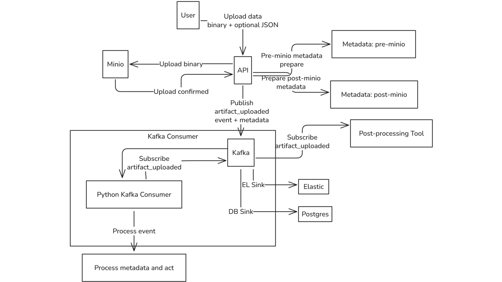
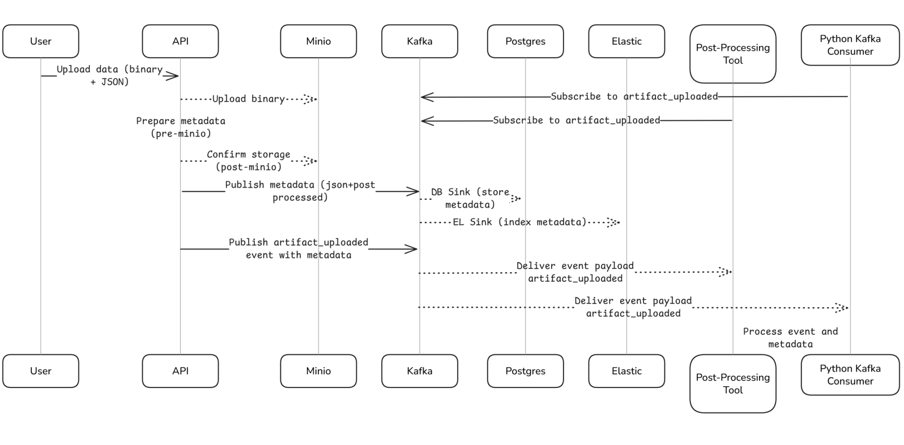

# HESTIA Data Pipeline

This project provides a Dockerized environment for a multi-modal data pipeline (HESTIA). It features an upload API with Kafka event streaming, Postgres persistence, MinIO (S3-compatible) storage, and Swagger UI for documentation. The system handles binary files (Artifacts) and structured data (Sensor Readings).

## Overview

The system consists of the following components:
- **Flask API**: A RESTful API built with Flask to handle uploads and queries. It uses an **API Key** for authentication.
- **Kafka**: Streams metadata and events (`artifacts`, `sensor_readings`, `artifact_uploaded`).
- **Kafka Connect**: Automatically syncs Kafka messages to Postgres (via JDBC sink).
- **Postgres**: Stores structured metadata and sensor readings.
- **MinIO**: Stores large binary files (images, logs, etc.) in an S3-compatible bucket.
- **Artifact Consumer**: An internal service that reacts to upload events (e.g., to update timestamps or trigger processing).






## Prerequisites

- [Docker](https://www.docker.com/get-started "null")
- [Docker Compose](https://docs.docker.com/compose/ "null")

## Project Structure

```
api/
├── api.py                  # Entry point for the Flask API
├── utils.py                # Shared utilities (DB connection, Auth, Kafka wrappers)
├── resources/              # API Resource definitions
│   ├── artifact.py         # Logic for Artifacts (Files)
│   └── sensor.py           # Logic for Sensor Readings (Data)
├── artifact_consumer.py    # Internal Kafka consumer service
├── Dockerfile.api          # Dockerfile for the API service
├── Dockerfile.consumer     # Dockerfile for the consumer service
├── requirements.txt        # Python dependencies
├── static/swagger.json     # Swagger UI definition

docker/
├── connectors/             # Kafka Connect configuration files
│   ├── postgres-sink.json  # Config for Artifacts table
│   └── sensor-sink.json    # Config for Sensor Readings table
├── docker-compose.yml      # Service orchestration
├── .env.example            # Template for environment variables
```

## Quick Start & Setup

### 1. Clone the Repository

```
git clone https://github.com/TEXTaiLES/HESTIA.git
cd HESTIA
```

### 2. Configure Security (.env)

**Important:** You must set up your local secrets before starting the app.
1. Navigate to the docker directory:

   ```
   cd docker
   ```
2. Copy the example environment file:

   ```
   cp .env.example .env
   ```
3. (Optional) Edit `.env` to change your `API_SECRET_KEY` or database passwords. *Default API Key:* `change-me-locally`

### 3. Start the Services

```
sudo docker-compose up --build -d
```

*Wait about 60 seconds for Kafka and Kafka Connect to fully initialize.*

### 4. Register Kafka Connectors

You must register the bridges that connect Kafka to Postgres. Run these commands from the `docker` directory:
- **Register Artifact Connector:**

  ```
  curl -X POST -H "Content-Type: application/json" \
    --data @connectors/postgres-sink.json \
    http://localhost:8083/connectors
  ```
- **Register Sensor Connector:**

  ```
  curl -X POST -H "Content-Type: application/json" \
    --data @connectors/sensor-sink.json \
    http://localhost:8083/connectors
  ```

## API Reference

**Base URL:** `http://localhost:5000` **Authentication:** All requests must include the header: `Authorization: Bearer <YOUR_API_KEY>`

### 1. Artifacts (Files)

`POST /artifacts` (Upload)

Supports Single File upload or Batch upload with a metadata map.
- **Single File Example:**

  ```
  curl -X POST http://localhost:5000/artifacts \
    -H "Authorization: Bearer change-me-locally" \
    -F "file=@assets/myimage.png" \
    -F "title=My Single Image" \
    -F "drone_id=Drone-Alpha-007"
  ```
- **Batch Upload Example:** Requires a `my_metadata.json` map file.

  ```
  curl -X POST http://localhost:5000/artifacts \
    -H "Authorization: Bearer change-me-locally" \
    -F "file=@assets/img1.png" \
    -F "file=@assets/img2.png" \
    -F "metadata_map=$(< my_metadata.json)"
  ```

`GET /artifacts` (Query)

Get a list of artifacts. Supports filtering and field selection.
- **List All:**

  ```
  curl -H "Authorization: Bearer change-me-locally" "http://localhost:5000/artifacts"
  ```
- **Filter & Select Fields:**

  ```
  curl -H "Authorization: Bearer change-me-locally" \
    "http://localhost:5000/artifacts?drone_id=Drone-Alpha-007&fields=filename,location"
  ```

`GET /artifacts/<artifact_id>` (Get One)

Get details for a specific artifact.

```
curl -H "Authorization: Bearer change-me-locally" \
  "http://localhost:5000/artifacts/3b62f2b9-3038-42ef-90c4-a0b490641af7"
```

### 2. Sensor Readings (Data)

`POST /sensor-readings`

Upload a single structured sensor reading.

```
curl -X POST http://localhost:5000/sensor-readings \
  -H "Authorization: Bearer change-me-locally" \
  -H "Content-Type: application/json" \
  -d '{
    "sensor_id": "Sensor-A1",
    "temperature": 24.5,
    "humidity": 60.2,
    "uv_intensity": 4.5,
    "timestamp": "2025-11-20T10:00:00Z"
  }'
```

## Accessing Internal Components

### MinIO (Object Storage)

- **URL:** [http://localhost:9001](https://www.google.com/search?q=http://localhost:9001 "null")
- **User:** `minioadmin` (or value in `.env`)
- **Pass:** `minioadmin` (or value in `.env`)

### Postgres (Database)

To inspect the database tables directly:

```
sudo docker exec -it postgres psql -U admin -d mydb -c "\dt"
```

Query the new sensor table:

```
sudo docker exec -it postgres psql -U admin -d mydb -c "SELECT * FROM sensor_readings LIMIT 5;"
```

### Swagger UI (Auto-Documentation)

- **URL:** [http://localhost:5000/docs](https://www.google.com/search?q=http://localhost:5000/docs "null")